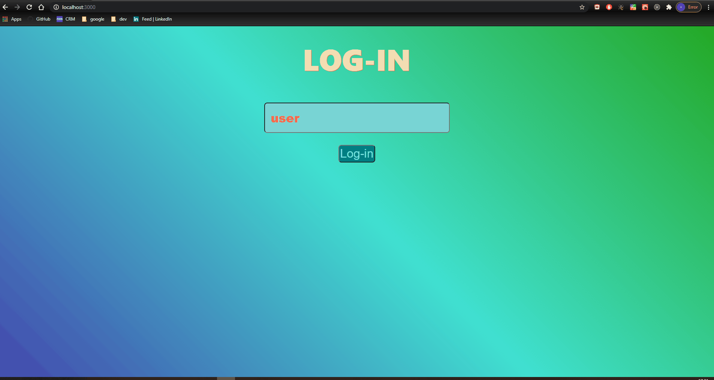

# Trivia Game

- This is a trivia game about countries.
  
  
  [Link to diagram](https://drawsql.app/yes-2/diagrams/trivia-task)

# Backend functionality:

## SQL:

- Created a model for each country database (6 in total) which we use for the answers.
- Each database is connected to the country-general table in a One to One connection using the country as a foreign key for each one.
- Created 3 models for the question generating functionality that gets the template and creating the question and the answers according to the
  template type, field, table, and question template.
- Also created a saved question database which saves the question, answers, usability and rating of the question after being rated by the client.
- Created a database called temp-right-answer that caches the right answer in a database to prevent cheating with the network panel in the dev tools.
- Also created a database for storing the score of the players.

## Server:

Server:
We separated the api into two different routers depending on the request.
Question router:
shuffle- a side function that helps us to randomize the answers so it won't follow the same pattern and prevent the answers from being predicted.

/generate request- gets a random question from our question-template databases and

# Frontend Functionality:

- LOGIN: you can enter youre name and watch youre score on the scoreboard
- MAIN PAGE: - Choose the right answer. you have 20 seconds for the first question, and afterwards every question gets 0/5 second less then it's preveious. - You can rate each question after answering it, questions with high rank will apear more! - Every question's score will determine by the speed of your answers, be quick! - There's 3 types of questions: - True\false questions. - compare questions. - General knowledge.
- SCOREBOARD: You can see all of the scores, ranked from highest to lowest.
